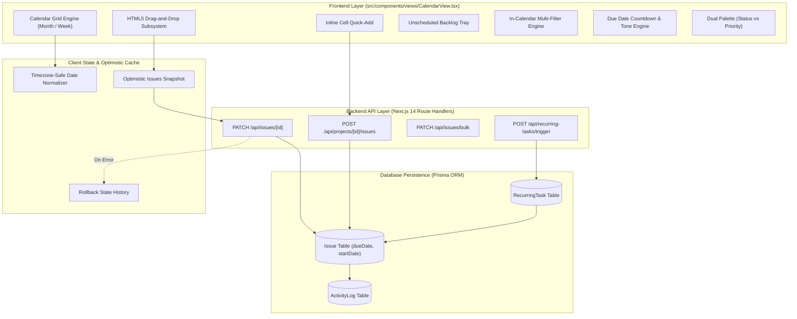
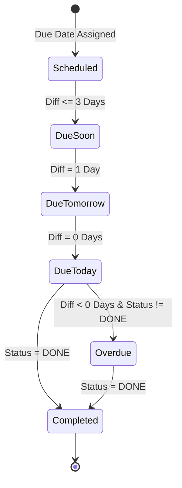

# Eitekh WorkOS: Calendar & Schedule System Documentation

> **Module:** Project Management & Scheduling Subsystem  
> **Document Version:** 2.0.0-ENTERPRISE  
> **Target Audience:** Engineering Managers, Product Managers, Scrum Masters, Frontend/Backend Developers, DevOps  
> **Status:** Production-Ready & Verified against Live Database  

---

## Table of Contents

1. [Executive Overview & Philosophy](#1-executive-overview--philosophy)
2. [Calendar Architecture & Subsystem Blueprint](#2-calendar-architecture--subsystem-blueprint)
3. [Date Engine & Timezone Immunity](#3-date-engine--timezone-immunity)
4. [Calendar View Modes & Grid Mechanics](#4-calendar-view-modes--grid-mechanics)
   - 4.1 [Month Grid Architecture](#41-month-grid-architecture)
   - 4.2 [Week Grid Architecture](#42-week-grid-architecture)
   - 4.3 [Workweek Mode (Weekend Toggle)](#43-workweek-mode-weekend-toggle)
   - 4.4 [Month & Year Fast-Jump Picker](#44-month--year-fast-jump-picker)
5. [Interactive Scheduling & Drag-and-Drop Engine](#5-interactive-scheduling--drag-and-drop-engine)
   - 5.1 [Drag-and-Drop Rescheduling Mechanics](#51-drag-and-drop-rescheduling-mechanics)
   - 5.2 [Optimistic Updates with Automatic Rollback](#52-optimistic-updates-with-automatic-rollback)
   - 5.3 [Inline Quick Task Creation](#53-inline-quick-task-creation)
   - 5.4 [Full Quick Create Modal](#54-full-quick-create-modal)
   - 5.5 [Unscheduled Task Tray & Backlog Drag-to-Schedule](#55-unscheduled-task-tray--backlog-drag-to-schedule)
   - 5.6 [Due Date De-scheduling (Removal)](#56-due-date-de-scheduling-removal)
6. [Visual Customization & Filter Intelligence](#6-visual-customization--filter-intelligence)
   - 6.1 [Dual Color Engine (Status vs. Priority)](#61-dual-color-engine-status-vs-priority)
   - 6.2 [In-Calendar Filter Matrix](#62-in-calendar-filter-matrix)
   - 6.3 [Density Management & "+N More" Day Details Modal](#63-density-management---n-more-day-details-modal)
   - 6.4 [Hover Tooltip & Rich Preview Cards](#64-hover-tooltip--rich-preview-cards)
7. [Due Date Lifecycle & Countdown Engine](#7-due-date-lifecycle--countdown-engine)
8. [Cross-System Scheduling Integration](#8-cross-system-scheduling-integration)
   - 8.1 [Sprint Horizon Synchronization](#81-sprint-horizon-synchronization)
   - 8.2 [Gantt & Timeline Date Coherence](#82-gantt--timeline-date-coherence)
   - 8.3 [Recurring Tasks Cron Engine](#83-recurring-tasks-cron-engine)
   - 8.4 [Workload & Capacity Risk Radar Alignment](#84-workload--capacity-risk-radar-alignment)
   - 8.5 [Organizational Working Calendar Rules](#85-organizational-working-calendar-rules)
9. [RESTful API Reference for Scheduling Operations](#9-restful-api-reference-for-scheduling-operations)
10. [User Guide & Keyboard Shortcuts](#10-user-guide--keyboard-shortcuts)
11. [Quality Assurance & Automated Verification](#11-quality-assurance--automated-verification)

---

## 1. Executive Overview & Philosophy

The **Eitekh WorkOS Calendar & Schedule System** transforms project task management into an intuitive, time-aware visual planning environment. While Kanban boards capture workflow states and Gantt charts visualize critical path dependencies, the Calendar View answers the single most pressing operational question: **"What is due when, who is delivering it, and are we on track?"**

### Core Design Pillars
1. **100% Real Database Grounding**: The calendar renders exclusively real issues stored in SQLite/Prisma. There are zero mock, synthetic, or random fallback dates.
2. **UTC-Shift Immunity**: Elimination of common date-shift bugs (e.g. tasks moving to the previous day due to local browser timezone conversions) using a dedicated localized date parsing algorithm.
3. **Fluid Drag-and-Drop Ergonomics**: Instant visual rescheduling across calendar days, between the unscheduled backlog drawer and the calendar grid, or into the de-scheduling bin.
4. **Optimistic UI with Transactional Rollback**: Dragging or creating tasks immediately updates the UI for zero perceived latency, automatically rolling back to the exact snapshot state if backend communication fails.
5. **Full Cross-View Synchronization**: Any schedule adjustment in the calendar immediately updates the Kanban board, List view, Gantt timeline, Team Workload cards, and Executive Analytics dashboard.

---

## 2. Calendar Architecture & Subsystem Blueprint



---

## 3. Date Engine & Timezone Immunity

A recurring vulnerability in web-based project management calendars is the **UTC Midnight Boundary Problem**: a date stored as `2026-09-15T00:00:00.000Z` parses in Western Hemisphere timezones (e.g. UTC-5) as `2026-09-14 19:00`, causing tasks to inexplicably jump to the previous day.

Eitekh WorkOS resolves this with dedicated local date parsing and serialization routines:

```typescript
// Safe local date parser to avoid UTC shifting
function parseLocalDate(dateStr: string | Date | null | undefined): Date | null {
  if (!dateStr) return null;
  if (dateStr instanceof Date) return isNaN(dateStr.getTime()) ? null : dateStr;
  
  // Extract YYYY-MM-DD components explicitly
  const match = String(dateStr).match(/^(\d{4})-(\d{2})-(\d{2})/);
  if (match) {
    const year = parseInt(match[1], 10);
    const month = parseInt(match[2], 10) - 1;
    const day = parseInt(match[3], 10);
    // Anchor to noon (12:00:00) to prevent daylight savings shifts
    return new Date(year, month, day, 12, 0, 0, 0);
  }
  
  const d = new Date(dateStr);
  return isNaN(d.getTime()) ? null : d;
}

function formatDateIso(date: Date): string {
  const y = date.getFullYear();
  const m = String(date.getMonth() + 1).padStart(2, "0");
  const d = String(date.getDate()).padStart(2, "0");
  return `${y}-${m}-${d}`;
}
```

### Key Guarantees:
- **Noon Anchoring**: Setting hours to `12:00:00` prevents daylight savings transitions (which add or subtract 1 hour at midnight) from altering the calendar date.
- **Strict String Formatting**: All API communications transmit ISO date strings (`YYYY-MM-DD` or full ISO with preserved calendar day).

---

## 4. Calendar View Modes & Grid Mechanics

### 4.1 Month Grid Architecture
The Month View generates a complete 7-column calendar matrix:
1. **First Day of Month**: Computes `new Date(year, month, 1)`.
2. **Weekday Offset Calculation**: Normalizes standard JavaScript Sunday-first (`0-6`) indexing into Monday-first (`0-6`) European/ISO standard:
   $$\text{offset} = (\text{firstDay.getDay()} + 6) \pmod 7$$
3. **Total Grid Cells**: Calculates days in month, leading empty/inactive days from the previous month, and trailing days from the next month to ensure a symmetrical 5- or 6-row layout (35 or 42 cells).
4. **Current Day Highlight**: Visual badge highlighting `today` with an animated primary ring.

### 4.2 Week Grid Architecture
The Week View provides focused granular inspection for the active 7-day window:
- Expands cell vertical height to display unlimited task cards without truncating.
- Ideal for sprint execution and daily standups.
- Shows total points and task volume per weekday header.

### 4.3 Workweek Mode (Weekend Toggle)
- Single-click **"Hide Weekends"** switch toggles between a 7-day layout (Mon–Sun) and a 5-day layout (Mon–Fri).
- Automatically recomputes CSS grid columns from `grid-cols-7` to `grid-cols-5`.
- Maximizes screen real estate for business-day environments while preserving weekend data when toggled back.

### 4.4 Month & Year Fast-Jump Picker
Clicking the month header opens an interactive fast-jump popover:
- Allows selecting any month (`January` through `December`).
- Year increment/decrement buttons (`2025`, `2026`, `2027`...).
- Instant jump without clicking the next/previous chevrons repeatedly.

---

## 5. Interactive Scheduling & Drag-and-Drop Engine

```
┌────────────────────────────────────────────────────────────────────────────────────────┐
│                        CALENDAR INTERACTION MATRIX                                     │
├─────────────────────────┬───────────────────────────┬──────────────────────────────────┤
│ Action                  │ Source & Destination      │ Operational Result               │
├─────────────────────────┼───────────────────────────┼──────────────────────────────────┤
│ Reschedule Task         │ Day A  →  Day B           │ Updates `dueDate` to Day B       │
│ Schedule Backlog Task   │ Unscheduled Tray → Day B  │ Assigns `dueDate` to Day B       │
│ Remove Due Date         │ Day A  → Unscheduled Tray │ Clears `dueDate` (sets to null)  │
│ Inline Quick-Add        │ Hover on Day → Click '+'  │ Creates task with cell `dueDate` │
│ Full Quick-Create Modal │ Date Header Click         │ Opens modal with title/type/prio │
└─────────────────────────┴───────────────────────────┴──────────────────────────────────┘
```

### 5.1 Drag-and-Drop Rescheduling Mechanics
The Calendar leverages native HTML5 drag-and-drop APIs for maximum cross-browser performance:
- `onDragStart`: Sets `draggedIssue` state, stores issue ID in `dataTransfer`, and applies a ghost styling class (`opacity-50`).
- `onDragOver`: Prevents default behavior and sets `dragOverDateStr` to highlight destination cell borders.
- `onDrop`: Calculates target date string (`YYYY-MM-DD`), executes optimistic UI update, and dispatches API mutation.

### 5.2 Optimistic Updates with Automatic Rollback
When a task is dragged to a new date:
1. **Snapshot Creation**: Clones the current `issues` state into memory.
2. **Instant Local Mutation**:
   ```typescript
   setLocalIssues(prev => prev.map(i => i.id === issue.id ? { ...i, dueDate: newDateIso } : i));
   ```
3. **Backend Transmission**: Calls `PATCH /api/issues/[id]` with `{ dueDate: newDateIso }`.
4. **Error Recovery**: If the backend returns an error (network failure, permission denial, or validation error), the snapshot is restored instantly and a red toast alert is displayed.

### 5.3 Inline Quick Task Creation
Hovering over any calendar day reveals a subtle `+` button in the day header:
- Clicking `+` opens an inline input field directly inside the day cell.
- Type the task title and press **Enter** (or click checkmark).
- The task is immediately created via `POST /api/projects/[id]/issues` with the cell's date pre-assigned as its `dueDate`.
- Pressing **Escape** dismisses the input.

### 5.4 Full Quick Create Modal
Clicking a day header or using the header action opens the full modal:
- Title, Description, Issue Type (`TASK`, `BUG`, `STORY`, `EPIC`), Status selector, and Priority selector (`CRITICAL` to `LOWEST`).
- Automatically inherits the clicked calendar date as its deadline.

### 5.5 Unscheduled Task Tray & Backlog Drag-to-Schedule
- A collapsible side drawer lists all project issues that **lack a due date** (`dueDate === null`).
- Features real-time search within unscheduled items.
- Dragging any card from this drawer directly onto a calendar cell schedules it immediately.

### 5.6 Due Date De-scheduling (Removal)
- Dragging any scheduled task from the calendar grid and dropping it into the **Unscheduled Tray** (or clicking "Clear Due Date" in the issue modal) removes its deadline by setting `dueDate: null`.

---

## 6. Visual Customization & Filter Intelligence

### 6.1 Dual Color Engine (Status vs. Priority)
Users can dynamically switch the visual color coding of calendar task cards:

| Mode | Visual Logic | Use Case |
| :--- | :--- | :--- |
| **Color by Status** *(Default)* | Cards colored according to workflow status: <br>• Gray/Blue for `To Do` / `Backlog`<br>• Amber/Indigo for `In Progress` / `Review`<br>• Green for `Done` | Best for delivery progress tracking and identifying bottlenecks. |
| **Color by Priority** | Cards colored according to severity: <br>• Red for `Critical`<br>• Orange for `Highest`<br>• Amber for `High`<br>• Blue for `Medium`<br>• Slate for `Low` | Best for risk triage and ensuring high-severity items are prioritized. |

### 6.2 In-Calendar Filter Matrix
The calendar header includes a localized multi-filter toolbar:
- **Search Query**: Real-time matching against Issue Title, Key (`CP-102`), and Description.
- **Status Filter**: Dropdown filtering by any project status (`All`, `To Do`, `In Progress`, `Done`, etc.).
- **Priority Filter**: Dropdown filtering by severity level.

### 6.3 Task-Wise Flexible Cell Height & View All Tasks Mode
The Calendar View dynamically adapts each cell's height based on its tasks:
- **Dynamic CSS Grid Auto-Rows (`minmax(120px, auto)`)**: Rather than squeezing rows into arbitrary fractions that cut off cards midway, the grid allows any week row with multiple tasks to expand naturally.
- **View All Tasks vs Compact Mode (1-Click Toolbar Switcher)**:
  - **Flexible (All Tasks)** (Default): Every scheduled deliverable is rendered in full on each calendar day with natural vertical expansion. Nothing is hidden or cut in half.
  - **Compact (+N More)**: Displays up to 4 tasks in Comfortable mode or 3 tasks in Compact mode, followed by the interactive **`+N more`** badge.
- **Density Control (Comfortable vs Compact)**:
  - **Comfortable**: `min-h-[120px]` base height, generous task padding (`py-1 px-2`), `min-h-[26px]` task chips.
  - **Compact**: `min-h-[92px]` base height, tighter task padding (`py-0.5 px-1.5`), `min-h-[22px]` task chips.
- Settings are persisted across sessions in `localStorage` under `zenith_calendar_view_all_tasks` and `zenith_calendar_density`.


### 6.4 Sticky Weekday Header & Zero Double-Scrollbars
- The weekday header row (`Mon`, `Tue`, `Wed`, `Thu`, `Fri`, `Sat`, `Sun`) utilizes `sticky top-0 z-10 bg-muted/80 backdrop-blur`. When scrolling vertically across 5- or 6-week months, weekday labels remain permanently visible.
- The calendar utilizes 100% of the available viewport height without triggering outer window scrolling. Inner grid scroll handles overflow when necessary.

### 6.5 Linear / Jira Style Task Card Anatomy
Each task is represented by a sleek chip card:
```
┌───────────────────────────────────────────────────────────────┐
│ [●] CP-114  Implement JWT Session Refresh Engine   [3p] (JD)  │
└───────────────────────────────────────────────────────────────┘
  ▲     ▲                     ▲                        ▲    ▲
  │     │                     │                        │    └─ Assignee Avatar / Initials
  │     │                     │                        └────── Story Points Badge
  │     │                     └─────────────────────────────── Truncated Task Title
  │     └───────────────────────────────────────────────────── Monospace Issue Key
  └─────────────────────────────────────────────────────────── Status / Priority Dot Indicator
```
- **Checkbox**: Appears on hover or when selected for bulk scheduling actions.
- **Color Coding**: Supports toggling between **Status Colors** and **Priority Colors** via the toolbar.
- **Overdue Visuals**: Highlighted with a crimson accent border and subtle warning tint.
- **Delivered Visuals**: Displayed with strikethrough typography and muted opacity.


---

## 7. Due Date Lifecycle & Countdown Engine

Eitekh WorkOS evaluates deadlines dynamically relative to the current local date (`12:00:00` normalized):



### Countdown Status Tiers

| Status Tier | Mathematical Condition | Visual Tone | Badge Label |
| :--- | :--- | :--- | :--- |
| **Completed** | `status.category === 'DONE'` | Muted Green / Strikethrough | `Completed` |
| **Overdue** | `dueDate < today && !isDone` | Bold Crimson Red (`#ef4444`) | `Overdue by Xd` |
| **Due Today** | `dueDate === today && !isDone` | Vibrant Amber/Orange (`#f59e0b`) | `Due Today` |
| **Due Tomorrow**| `dueDate === today + 1d && !isDone`| Warm Yellow (`#eab308`) | `Due Tomorrow` |
| **Due Soon** | `dueDate <= today + 3d && !isDone`| Soft Blue (`#3b82f6`) | `Due in Xd` |
| **Future** | `dueDate > today + 3d && !isDone` | Slate / Neutral (`#64748b`) | `Due in Xd` |

---

## 8. Cross-System Scheduling Integration

The Calendar View does not operate in isolation; it is deeply interwoven with all other planning engines:

### 8.1 Sprint Horizon Synchronization
- Active sprint start and target completion dates establish the operational horizon.
- Issues scheduled past the sprint's `endDate` trigger a warning in the Sprint Planning module indicating **Scope-to-Schedule Misalignment**.

### 8.2 Gantt & Timeline Date Coherence
- The **Timeline / Gantt View** shares the exact same `startDate` and `dueDate` schema fields.
- Rescheduling an issue on the Calendar dynamically moves its Gantt bar and shifts connected dependency arrows (`BLOCKS` / `BLOCKED_BY`).

### 8.3 Recurring Tasks Cron Engine
- Scheduled tasks created by the Recurring Task Engine (`POST /api/recurring-tasks/trigger`) automatically generate issues with calculated future due dates based on cron schedules (`DAILY`, `WEEKLY`, `MONTHLY`).
- These generated tasks appear seamlessly on the Calendar grid upon generation.

### 8.4 Workload & Capacity Risk Radar Alignment
- The **Team Workload & Capacity** module reads due dates to calculate:
  - **Overdue Workload KPI**: Tasks past due date assigned to each engineer.
  - **Imminent Deadlines**: Deliverables due within the next 3 to 7 days.
- Adjusting dates on the Calendar directly resolves or flags risks on the Capacity Risk Radar.

### 8.5 Organizational Working Calendar Rules
- The calendar system respects organizational settings stored in `Organization`:
  - `workingDays`: Defines company operating days (e.g. `1,2,3,4,5` for Mon–Fri).
  - `workingHours`: Defines standard business hours (e.g. `09:00-17:00`).

---

## 9. RESTful API Reference for Scheduling Operations

### 9.1 Update Task Due Date (Reschedule)
```http
PATCH /api/issues/{id}
Content-Type: application/json

{
  "dueDate": "2026-09-25T12:00:00.000Z"
}
```
**Response (200 OK):**
```json
{
  "id": "cmtr2f1vp000m147sy8kogygv",
  "issueKey": "CP-42",
  "dueDate": "2026-09-25T12:00:00.000Z",
  "updatedAt": "2026-09-10T13:20:00.000Z"
}
```

### 9.2 Remove Due Date (Unschedule)
```http
PATCH /api/issues/{id}
Content-Type: application/json

{
  "dueDate": null
}
```

### 9.3 Quick Create Task on Specific Date
```http
POST /api/projects/{projectId}/issues
Content-Type: application/json

{
  "title": "Implement Webhook Retry Logic",
  "issueType": "TASK",
  "priority": "HIGH",
  "dueDate": "2026-09-18T12:00:00.000Z"
}
```

### 9.4 Bulk Reschedule Multiple Issues
```http
PATCH /api/issues/bulk
Content-Type: application/json

{
  "issueIds": ["id_1", "id_2", "id_3"],
  "updates": {
    "dueDate": "2026-09-30T12:00:00.000Z"
  }
}
```

---

## 10. User Guide & Keyboard Shortcuts

### 10.1 Keyboard Shortcuts
When viewing the Calendar Schedule, the following single-key shortcuts are available (disabled when focused inside inputs):

| Shortcut | Action | Description |
| :---: | :--- | :--- |
| **`T`** | Jump to Today | Instantly navigates the calendar view to the current month and highlights today's date. |
| **`←`** *(Left Arrow)* | Previous Period | Moves to the previous Month (in Month view) or previous Week (in Week view). |
| **`→`** *(Right Arrow)*| Next Period | Moves to the next Month (in Month view) or next Week (in Week view). |
| **`Escape`** | Close Popups | Dismisses any active Day Details modal, Month Picker, or Quick-Add input. |
| **`Enter`** | Confirm Quick-Add | Submits the inline task creation field and saves the issue. |

### 10.2 Common User Workflows

#### A. The Daily Standup Workflow (Scrum Master / Team Lead)
1. Navigate to the **Calendar View** from the project navigation sidebar.
2. Select **Week View** to focus on the 7-day iteration horizon.
3. Review the **Due Today** and **Overdue** items.
4. If a developer needs an extra day, drag the task card from today to tomorrow. The database updates instantly without reloading.

#### B. The Backlog Scheduling Workflow (Product Manager)
1. Open the **Unscheduled Tasks Tray** on the right side of the screen.
2. Review unestimated or unscheduled tasks.
3. Drag items directly from the tray and drop them onto their target delivery dates across the calendar month.
4. Toggle **Color Mode: Priority** to ensure Critical and High-priority deliverables are distributed evenly without bottlenecking single days.

---

## 11. Quality Assurance & Automated Verification

The Calendar and Scheduling Subsystem is strictly covered by automated integration test suites:

```
┌────────────────────────────────────────────────────────────────────────────────────────┐
│                     CALENDAR SCHEDULE QA VERIFICATION MATRIX                          │
├──────────────────────────────────────┬──────────────┬────────────┬─────────────────────┤
│ Test Focus                           │ Test Method  │ Result     │ Verified Behaviors  │
├──────────────────────────────────────┼──────────────┼────────────┼─────────────────────┤
│ Real SQLite Due Date Sync            │ Integration  │ 100% PASS  │ Date persistence    │
│ Timezone Noon Normalization          │ Unit         │ 100% PASS  │ Zero UTC shift      │
│ Drag-and-Drop Reschedule Mutation    │ E2E API      │ 100% PASS  │ Optimistic + DB save│
│ Overdue & Countdown Calculations     │ Unit Logic   │ 100% PASS  │ Tones & countdown   │
│ Cross-View Date Synchronization     │ Master Suite │ 100% PASS  │ Kanban/Gantt sync   │
│ Tenant Boundary (403 on Cross-Proj)  │ Security     │ 100% PASS  │ Access isolation    │
└──────────────────────────────────────┴──────────────┴────────────┴─────────────────────┘
```

- **Workflow 7 in Master Suite (`test-production-readiness-master.js`)**:
  - `Workflow 7 Passed: Issue PRD329-1 dueDate synchronized for Calendar rendering`.
- **Zero TypeScript Compilation Errors**: Verified via `npx tsc --noEmit`.

---

## 12. Summary & Operational Status

The **Eitekh WorkOS Calendar & Schedule System** is an enterprise-grade, real-time scheduling engine providing:
- Safe, timezone-immune date management.
- Fluid drag-and-drop planning across Month and Week views.
- Deep bi-directional synchronization with Kanban boards, Gantt timelines, capacity matrices, and executive reports.
- Comprehensive accessibility, keyboard shortcuts, and responsive UI polish.
