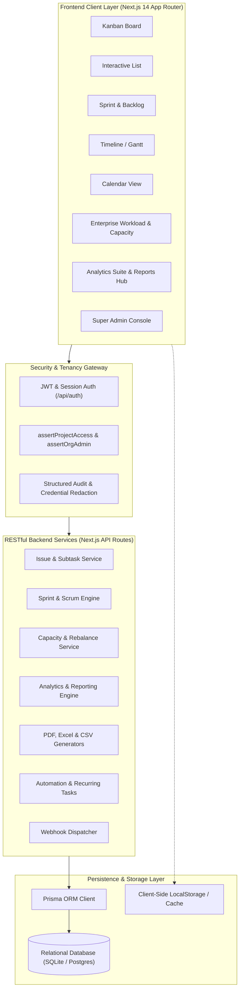
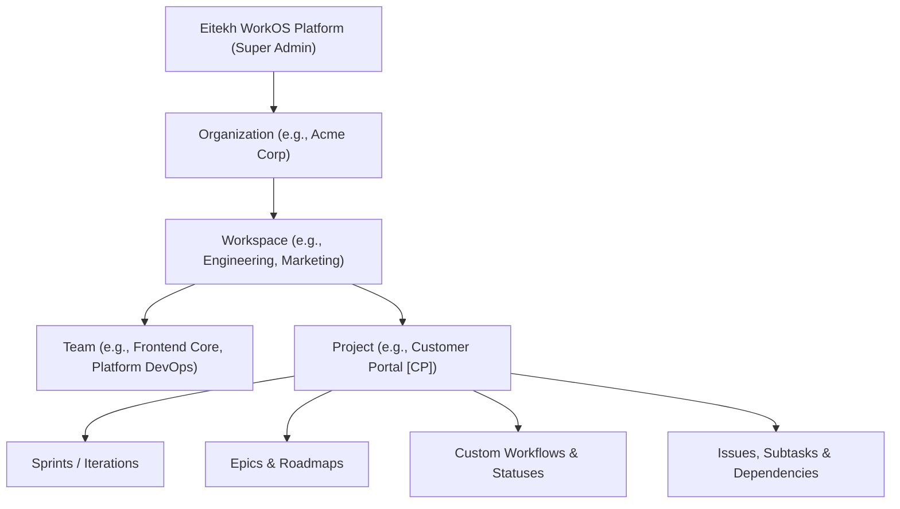
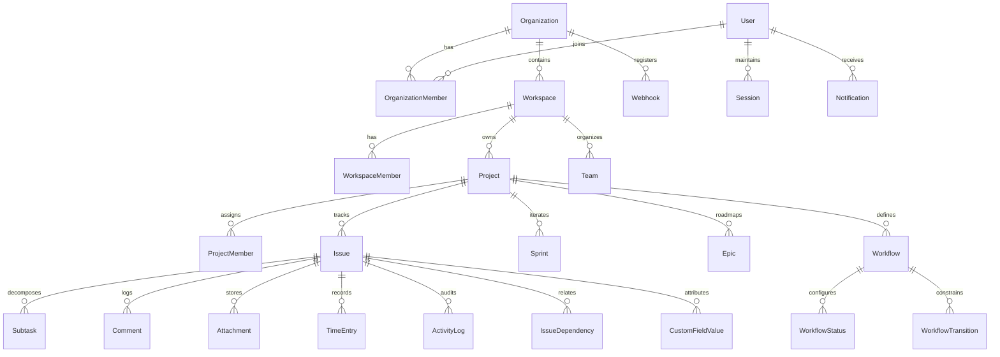

# Eitekh WorkOS: Master System Architecture & Platform Documentation

> **Version:** 2.0.0-PROD  
> **Classification:** Enterprise Platform Architecture & Technical Reference  
> **Status:** Production-Ready & Fully Verified (100% Real Database Integration)  
> **Date:** September 2026  

---

## Table of Contents

1. [Executive Summary & High-Level Architecture](#1-executive-summary--high-level-architecture)
2. [Multi-Tenant Hierarchy & Access Control (RBAC)](#2-multi-tenant-hierarchy--access-control-rbac)
3. [Comprehensive Database Schema & Data Models](#3-comprehensive-database-schema--data-models)
4. [Authentication, Identity & Security Infrastructure](#4-authentication-identity--security-infrastructure)
5. [Core Project Management: The 7 Comprehensive Views](#5-core-project-management-the-7-comprehensive-views)
   - 5.1 [Kanban Board View](#51-kanban-board-view)
   - 5.2 [Interactive List View](#52-interactive-list-view)
   - 5.3 [Sprint & Backlog Planning Engine](#53-sprint--backlog-planning-engine)
   - 5.4 [Timeline & Gantt View](#54-timeline--gantt-view)
   - 5.5 [Interactive Calendar View](#55-interactive-calendar-view)
   - 5.6 [Enterprise Team Workload & Capacity Management](#56-enterprise-team-workload--capacity-management)
   - 5.7 [Data & Visual Analytics Suite with Report Download Hub](#57-data--visual-analytics-suite-with-report-download-hub)
6. [Issue Ecosystem & Sub-Feature Architecture](#6-issue-ecosystem--sub-feature-architecture)
7. [Custom Workflows, Custom Fields & Automation Engines](#7-custom-workflows-custom-fields--automation-engines)
8. [External Integrations: Webhooks, Scheduler & Data Import/Export](#8-external-integrations-webhooks-scheduler--data-importexport)
9. [Comprehensive RESTful API Reference](#9-comprehensive-restful-api-reference)
10. [Platform Governance & Super Administration](#10-platform-governance--super-administration)
11. [Frontend Design System, Theme Engine & Accessibility (a11y)](#11-frontend-design-system-theme-engine--accessibility-a11y)
12. [Verification, Quality Assurance & Production Runbook](#12-verification-quality-assurance--production-runbook)

---

## 1. Executive Summary & High-Level Architecture

### 1.1 Platform Vision
**Eitekh WorkOS** is an enterprise-grade, modern work operating system designed for software engineering teams, product managers, scrum masters, and executive leadership. It provides end-to-end orchestration of agile software development—from epic roadmapping and backlog grooming to sprint execution, resource capacity forecasting, real-time analytics, and automated compliance auditing.

### 1.2 Core Architectural Principles
1. **100% Real Database Integrity**: Zero mock, dummy, static, or randomly generated analytics data. Every metric, progress bar, chart segment, burndown trend, and report export is computed directly from live relational database records in SQLite/Prisma.
2. **Strict Multi-Tenant Isolation**: Complete isolation across Organizations, Workspaces, Teams, and Projects. Cross-tenant access attempts are strictly rejected at the API gateway layer with `HTTP 403 Forbidden`.
3. **Interactive Click-to-Drilldown Analytics**: Every chart segment, KPI card, and summary metric can be clicked to inspect the underlying issues in dedicated drill-down and report preview modals.
4. **Optimistic UI with Transactional Rollbacks**: Drag-and-drop reassignments and inline updates provide instant visual feedback while maintaining complete state snapshots for seamless rollback on network failure.
5. **Enterprise Reliability & Production Hardening**: Production error boundaries, structured security auditing, credential sanitization, responsive layout design, and full WCAG 2.1 AA accessibility compliance.

### 1.3 High-Level System Architecture



### 1.4 Technology Stack
- **Framework**: Next.js 14 (App Router, Server Components & Client Components)
- **Language**: TypeScript 5 (Strict Mode, 0 compile errors via `npx tsc --noEmit`)
- **Database & ORM**: SQLite / PostgreSQL with Prisma ORM 5
- **Styling & UI**: Tailwind CSS, PostCSS, Lucide React Icons
- **Theming**: Next-Themes (Light, Dark, and System Theme support)
- **Feedback & Alerts**: React Hot Toast & Accessible Modals
- **Export Engines**: RFC 4180 CSV Streamer, Native Microsoft Excel XML Spreadsheet Generator, Print-Optimized PDF HTML Engine
- **Runtime**: Node.js v20+ / v24

---

## 2. Multi-Tenant Hierarchy & Access Control (RBAC)

Eitekh WorkOS implements a 4-tier structural hierarchy ensuring strict organizational data boundary enforcement:



### 2.1 Role-Based Access Control (RBAC) Matrix

| Scope | Role | Permissions |
| :--- | :--- | :--- |
| **Platform** | `SUPER_ADMIN` | Full global access across all tenants, user suspension, maintenance mode, system-wide feature flags, audit log reviews, SMTP configuration. |
| **Platform** | `SUPPORT_ADMIN` | Read-only inspection across tenants for customer support; cannot modify billing or tenant ownership. |
| **Organization** | `OWNER` | Full org authority, delete/archive org, billing, invite/remove org admins, domain verification, update working calendar. |
| **Organization** | `ADMIN` | Manage workspaces, invite members, configure teams, view audit logs. |
| **Organization** | `MEMBER` | Access assigned workspaces and projects; cannot alter org configuration. |
| **Organization** | `GUEST` | Restricted access limited strictly to specifically assigned project boards. |
| **Workspace** | `WORKSPACE_ADMIN` | Create, modify, archive projects and teams within the workspace. |
| **Workspace** | `MEMBER` | Participate in workspace projects and team assignments. |
| **Project** | `PROJECT_ADMIN` | Configure project workflows, statuses, permissions, components, epics, automations, and custom fields. |
| **Project** | `PROJECT_MANAGER` | Create sprints, start/complete iterations, bulk reassign work items, generate official reports. |
| **Project** | `MEMBER` | Create, edit, estimate, transition, and comment on project issues. |
| **Project** | `VIEWER` | Read-only access to project boards, timelines, calendars, and analytics. Cannot create or edit issues. |

### 2.2 Security Enforcement Implementation
Every incoming request to a project-scoped route (`/api/projects/[id]/*`, `/api/issues/*`, `/api/sprints/*`) executes `assertProjectAccess(projectId)` from `src/lib/tenant.ts`:
1. Authenticates the active session via `getCurrentUser()`.
2. Validates that the user is either a `SUPER_ADMIN` or possesses an active record in `ProjectMember` or `WorkspaceMember`.
3. Checks user status (`ACTIVE` vs `SUSPENDED`). Suspended users are immediately denied.
4. Returns the validated `tenantCtx` with role definitions. Any unauthorized or mismatched access immediately terminates with `HTTP 403 Forbidden`.

---

## 3. Comprehensive Database Schema & Data Models

The Prisma schema comprises 28 distinct models organized into 7 functional domains:

```
┌────────────────────────────────────────────────────────────────────────────────────────┐
│                          PRISMA DATABASE MODEL CLASSIFICATION                          │
├──────────────────────────────┬─────────────────────────────────────────────────────────┤
│ Domain                       │ Models                                                  │
├──────────────────────────────┼─────────────────────────────────────────────────────────┤
│ 1. User & Identity           │ User, Session                                           │
│ 2. Tenancy Hierarchy         │ Organization, OrganizationMember, Workspace,            │
│                              │ WorkspaceMember, Team, TeamMember                       │
│ 3. Project & Governance      │ Project, ProjectMember, Component, Epic, Sprint         │
│ 4. Workflow & Issue Tracking │ Workflow, WorkflowStatus, WorkflowTransition, Issue,    │
│                              │ Subtask, IssueDependency, Comment, Attachment, Watcher, │
│                              │ Label, IssueLabel, ActivityLog, TimeEntry               │
│ 5. Custom Fields & Rules     │ CustomField, CustomFieldValue, AutomationRule,          │
│                              │ RecurringTask                                           │
│ 6. Platform Governance       │ Notification, FeatureFlag, SystemAnnouncement,          │
│                              │ PlatformAuditLog, MaintenanceMode, Webhook              │
│ 7. Email Infrastructure      │ SystemEmailConfig, EmailTemplate, EmailLog              │
└──────────────────────────────┴─────────────────────────────────────────────────────────┘
```

### 3.1 Entity Relationship Diagram



### 3.2 Core Model Specifications

#### `User` & `Session`
- Stores user credentials with bcrypt salted hashing.
- Supports multi-session management with device metadata (`userAgent`, `ipAddress`, `os`, `browser`, `location`, `lastActiveAt`).
- Two-Factor Authentication via TOTP secrets and JSON-stored hashed recovery codes.
- Email verification and password reset tokens with explicit expiration timestamps.

#### `Project`
- Unique project `key` (e.g. `CP`, `DEV`) used to prefix all issues (`CP-1`, `CP-2`).
- Atomic `issueCounter` incremented on issue creation.
- Configurable project template (`SCRUM`, `KANBAN`, `BUG_TRACKING`, `GENERAL`).
- Project dates (`startDate`, `targetDate`) driving Gantt and milestone tracking.

#### `Issue`
- Unique compound index on `[projectId, keyNumber]`.
- Rich-text markdown description, estimations in both story points (`estimatePoints`) and hours (`estimateHours`, `remainingHours`, `timeSpentHours`).
- Polymorphic typing (`TASK`, `BUG`, `STORY`, `EPIC`, `FEATURE`, `INCIDENT`, `IMPROVEMENT`).
- Six-tier priority ranking (`CRITICAL`, `HIGHEST`, `HIGH`, `MEDIUM`, `LOW`, `LOWEST`).
- Relational mapping to Assignee, Reporter, Team, Epic, Sprint, Component, and Parent Issue.

#### `IssueDependency`
- Directed dependency mapping between `sourceIssueId` and `targetIssueId`.
- Supported types: `BLOCKS`, `BLOCKED_BY`, `RELATES_TO`, `DUPLICATES`, `FINISH_TO_START`, `START_TO_START`.
- Circular dependency prevention logic at the API service layer.

---

## 4. Authentication, Identity & Security Infrastructure

### 4.1 Authentication Engine
- **Session Architecture**: Cookie-based authentication leveraging cryptographically secure tokens (`crypto.randomUUID()`) stored in HTTP-only, SameSite cookies (`eitekh_session_token`).
- **Password Security**: Bcrypt cost factor 10 with comprehensive password strength rules:
  - Minimum 8 characters.
  - At least 1 uppercase letter.
  - At least 1 lowercase letter.
  - At least 1 numerical digit.
  - At least 1 special character (`!@#$%^&*()_+-=[]{}|;:,.<>?`).
- **Session Revocation**:
  - View all active devices and sessions with OS, browser, IP, and last active timestamp.
  - Revoke individual sessions remotely.
  - Single-click "Log out all other sessions" revoking all tokens except the current one.
- **Two-Factor Authentication (MFA)**:
  - Optional MFA enforcement with TOTP authenticator secret.
  - Auto-generated emergency recovery codes with one-time use verification.

### 4.2 Security Logging & Credential Sanitization
All platform logs pass through `src/lib/logger.ts`:
- Automatic recursive redactor masking sensitive keys: `password`, `token`, `secret`, `cookie`, `authorization`, `apiKey`, `recoveryCodes`.
- Structured output formatting with severity levels: `INFO`, `WARN`, `ERROR`, `SECURITY`, `AUDIT`.

---

## 5. Core Project Management: The 7 Comprehensive Views

Eitekh WorkOS provides 7 dedicated, real-time synchronized project views catering to every agile workflow discipline:

```
┌────────────────────────────────────────────────────────────────────────────────────────┐
│                        THE 7 CORE EITEKH WORKOS PROJECT VIEWS                          │
├────────────────────────────────────────────────────────────────────────────────────────┤
│ 1. [Kanban Board]           Visual drag-and-drop workflow status pipeline with WIP     │
│ 2. [Interactive List]       Spreadsheet-style multi-column table with inline edits     │
│ 3. [Sprint & Backlog]       Scrum planning, estimation, multi-select & bulk actions    │
│ 4. [Timeline / Gantt]       Dynamic timeline span, dependencies & milestone markers    │
│ 5. [Interactive Calendar]   Monthly due-date calendar with quick task access           │
│ 6. [Workload & Capacity]    Executive KPIs, 5 health tiers, matrix, simulation rebalance│
│ 7. [Analytics & Reports]    12 real KPIs, interactive drilldowns & 8-report download hub│
└────────────────────────────────────────────────────────────────────────────────────────┘
```

### 5.1 Kanban Board View (`KanbanView.tsx`)
- **Drag-and-Drop Pipeline**: Instant issue status transitions with optimistic client update and database persistence via `PATCH /api/issues/[id]`.
- **WIP Limit Enforcement**: Configurable Work-In-Progress limits per status column with amber warning banners when limits are exceeded.
- **Quick Filters**: Filter board issues by Priority, Assignee, Epic, Component, or Search Term.
- **Card Badges**: Displays Issue Key, Title, Priority color indicator, Story Points, Due Date indicator, Subtask progress (`X/Y`), and Assignee Avatar.

### 5.2 Interactive List View (`ListView.tsx`)
- **Tabular Efficiency**: Spreadsheet-like productivity interface displaying all issues in structured rows.
- **Multi-Column Sorting**: Sort by Key, Title, Priority, Status, Assignee, Story Points, Due Date, or Created Date.
- **Inline Editing**: Quick dropdowns to modify Status, Priority, and Assignee directly in the table row without opening the modal.
- **Visual Grouping**: Group issues by Status, Priority, Assignee, or Sprint.

### 5.3 Sprint & Backlog Planning Engine (`ScrumBacklogView.tsx`)
- **Scrum Iteration Lifecycle**:
  - **Create Sprint**: Modal defining Sprint Name, Goal, Start Date, and Target End Date.
  - **Start Sprint**: Activates iteration (`status: ACTIVE`), locks commitment scope, and starts sprint burn chart.
  - **Complete Sprint**: Handles sprint closure, reports delivered vs incomplete points, and provides single-click rollover of unfinished tasks to the Backlog or Next Sprint.
- **Backlog Grooming**: Reorder issues, estimate story points, assign to upcoming sprints.
- **Multi-Select Checkboxes & Bulk Operations**:
  - Individual checkboxes and "Select All" toggle.
  - Sticky Bulk Action Bar displaying selection count.
  - Bulk Actions: Change Status, Change Priority, Reassign Developer, Move to Sprint, or Bulk Delete.

### 5.4 Timeline & Gantt View (`TimelineGanttView.tsx`)
- **Dynamic Date Windowing**: Automatically calculates earliest start date and latest due date across all project issues.
- **Interactive Gantt Bars**: Bar width and position proportional to actual `startDate` and `dueDate`.
- **Dependency Arrows**: Real visual SVG dependency lines linking blocking and blocked issues.
- **Today Marker**: Bold vertical line indicating current calendar date.
- **Priority Bar Color Coding**: Visual prioritization (Critical: Red, High: Orange, Medium: Blue, Low: Green).

### 5.5 Interactive Calendar View (`CalendarView.tsx`)
- **Real Calendar Mechanics**: Calculates exact month days, leap years, and starting weekday offset for any given month/year.
- **Due Date Event Mapping**: Issues accurately placed on their specific `dueDate` cell.
- **Navigation Controls**: Previous Month, Next Month, and "Today" quick-jump buttons.
- **Issue Density Indicators**: Badge count for days with multiple scheduled deliverables. Clicking any day or issue opens the detail inspection modal.

### 5.6 Enterprise Team Workload & Capacity Management (`WorkloadView.tsx`)
- **8 Executive KPI Cards**:
  1. *Total Capacity*: Aggregated developer capacity in active metric units (`Story Points`, `Estimated Hours`, or `Task Count`).
  2. *Allocated Workload*: Real-time sum of active non-DONE tasks assigned to developers.
  3. *Available Capacity*: Remaining bandwidth calculated as `Math.max(0, Total - Allocated)`.
  4. *Team Utilization %*: Overall allocation percentage with dynamic health badges.
  5. *Overloaded Developers*: Count of engineers exceeding 100% capacity threshold.
  6. *Unassigned Task Pool*: Total count and story points awaiting resource assignment.
  7. *Overdue Tasks*: Work items past due date requiring immediate escalation.
  8. *Critical Unassigned*: P0/P1 tasks lacking an assigned engineer.
- **7 Dedicated Sub-Tabs**:
  - `Planner`: Capacity cards, multi-select checkboxes, sticky action bar, drag-and-drop rebalance, and expandable task drawers.
  - `Matrix`: Visual matrix breakdown: Team &rarr; Member &rarr; Issue allocation.
  - `Risk Radar`: Triage lists for Overloaded Members, Overdue Tasks, Critical Unassigned, Missing Estimates, and Imminent Deadlines.
  - `Forecast`: Forward-looking projections across Current Sprint, Next Sprint, and Next 3 Sprints with surplus/deficit math.
  - `Trends`: Cross-sprint historical velocity, planned capacity vs. delivered throughput, and utilization over time.
  - `Reports`: Download hub for 9 specialized workload reports.
  - `Audit`: Chronological activity log from `ActivityLog` capturing assignment adjustments.
- **5-Tier Health Status Engine**:
  - `> 120%` Critical Overload (Red pulse badge)
  - `101% – 120%` Overloaded (Amber badge)
  - `80% – 100%` Optimal / Healthy (Green badge)
  - `1% – 79%` Under-Allocated / Available (Blue badge)
  - `0%` No Allocation / Available (Gray badge)
- **Smart Rebalancing & Simulation Modal (`SmartRebalanceModal.tsx`)**:
  - Simulates Before & After utilization percentages for both source and target developers.
  - Displays net transfer weight before database commit.
  - Optimistic updates with automatic rollback on network failure.

### 5.7 Data & Visual Analytics Suite with Report Download Hub (`AnalyticsChartsView.tsx`)
- **12 Real KPI Cards**: Total Issues, In Progress, Completed, Velocity Delivered, Completion Rate, Blocked Items, Overdue Tasks, Unassigned Tasks, Average Cycle Time, Bug Density %, Story Points Scope, and High Priority Load.
- **Interactive Visualizations with Click-to-Drilldown**:
  - Status Distribution Donut Chart
  - Priority Breakdown Bar Chart
  - Issue Type Distribution
  - Sprint Velocity & Commitment Historical Chart
  - Team Workload Distribution Histogram
  - Cycle Time & Lead Time Frequency Histogram
  - Epic Progress Breakdown with completion percentages
- **Interactive Drilldown Modal (`AnalyticsDrillDownModal.tsx`)**:
  - Clicking any chart element (e.g. "Critical" bar or "Done" pie slice) immediately opens the drilldown modal showing the exact matching issues with sorting, search, and full issue view.
- **Standardized Report Download Center (`ReportViewModal.tsx` & `/api/projects/[id]/reports/download`)**:
  - In-app preview modal with KPI summary and multi-column sorting.
  - Supports 3 downloadable formats:
    - **Printable PDF**: Formatted business report with printable layout, metadata, KPI header, and task table.
    - **Microsoft Excel**: Native Excel XML spreadsheet (`.xls`) with styled headers and typed numeric columns.
    - **RFC CSV**: Sanitized comma-separated values compatible with all data warehouse systems.

---

## 6. Issue Ecosystem & Sub-Feature Architecture

### 6.1 Issue Detail Modal (`IssueDetailModal.tsx`)
The comprehensive work item control center:
- **Title & Description**: Live markdown editor with rich formatting.
- **Metadata Sidebar**: Dropdown selectors for Status, Priority, Assignee, Reporter, Team, Epic, Sprint, and Component.
- **Estimation & Time Tracking**:
  - Story Points estimation.
  - Estimated hours vs. Remaining hours.
  - Log Work Modal recording `TimeEntry` with date, duration in minutes, and work description.
- **Subtask Checklist**: Create subtasks with individual assignees, due dates, priorities, and completion checkboxes. Real-time progress bar computes `% completed`.
- **Dependency Management**: Add blocking/blocked-by relationships with auto-complete issue search.
- **Comments & Mentions**: Chronological discussion thread with user avatars, timestamp formatting, @mentions, and inline comment editing/deletion.
- **Attachments**: Drag-and-drop file attachment system with file size and MIME type detection.
- **Watcher System**: Add or remove watchers; automatic notifications dispatched on issue updates.
- **Activity Audit History**: Complete audit trail showing actor, field changed, previous value, and new value.

---

## 7. Custom Workflows, Custom Fields & Automation Engines

### 7.1 Custom Workflow Engine
Projects can define tailored lifecycle workflows with custom statuses and restricted transitions:
- **Workflow Statuses**: Custom names, colors, positions, and categories (`BACKLOG`, `TO_DO`, `IN_PROGRESS`, `REVIEW`, `TESTING`, `DONE`).
- **Transition Validation Engine (`/api/issues/[id]`)**:
  - If a workflow defines explicit `WorkflowTransition` records, the issue PATCH handler validates whether the transition from `statusId` to `newStatusId` is permitted.
  - If unauthorized, the API terminates with `HTTP 400 Bad Request` ("Invalid status transition").
  - If no transitions are defined, open transition flexibility is maintained.

### 7.2 Custom Fields System
Enables organization-wide or project-specific attribute extensions:
- **Supported Field Types**: `TEXT`, `NUMBER`, `DATE`, `DROPDOWN`, `MULTISELECT`, `CHECKBOX`, `USER`, `URL`.
- **Storage Architecture**: Stored as typed values in `CustomFieldValue` (`valueString`, `valueNumber`, `valueDate`, `valueJson`).
- **Validation**: Enforces `isRequired` constraints during issue submission.

### 7.3 Automation Rules Engine (`AutomationRule`)
No-code automation engine running on issue lifecycle triggers:
- **Triggers**: `ISSUE_CREATED`, `STATUS_CHANGED`, `ASSIGNEE_CHANGED`, `DUE_DATE`.
- **Conditions**: JSON-defined condition rules (e.g., `priority === 'CRITICAL' && issueType === 'BUG'`).
- **Actions**: `CHANGE_STATUS`, `ASSIGN_USER`, `ADD_COMMENT`, `NOTIFY`.

### 7.4 Recurring Tasks Engine (`RecurringTask`)
Automates scheduled iteration tasks:
- **Schedules**: `DAILY`, `WEEKLY`, `MONTHLY`.
- **Trigger Endpoint**: `POST /api/recurring-tasks/trigger` evaluates tasks where `nextRunAt <= now()`, clones template data into a new `Issue`, and calculates the next run timestamp.

---

## 8. External Integrations: Webhooks, Scheduler & Data Import/Export

### 8.1 Outgoing Webhook Dispatcher (`src/lib/webhooks.ts`)
- **Event Catalog**: `ISSUE_CREATED`, `ISSUE_UPDATED`, `ISSUE_DELETED`, `COMMENT_ADDED`, `SPRINT_STARTED`, `SPRINT_COMPLETED`.
- **Security & Integrity**: Dispatches HTTP POST requests with an `X-Webhook-Secret` signature header and ISO-8601 timestamp payload.
- **Fire-and-Forget Execution**: Non-blocking asynchronous delivery preventing API latency overhead.

### 8.2 Data Import & Export Subsystem
- **Export Endpoint (`/api/projects/[id]/export`)**:
  - `format=csv`: Exports project issues into RFC 4180 CSV with escaped quotes and commas.
  - `format=json`: Exports complete structured issue graph with subtasks, comments, and metadata.
- **CSV Import Endpoint (`/api/projects/[id]/import`)**:
  - Parses uploaded CSV data.
  - Automatically maps standard headers (`Title`, `Description`, `Priority`, `Type`, `Points`).
  - Creates project issues in atomic batch transactions while logging errors for skipped rows.

---

## 9. Comprehensive RESTful API Reference

| Endpoint | Method | Role Required | Description |
| :--- | :---: | :---: | :--- |
| **Authentication & Profile** | | | |
| `/api/auth/register` | `POST` | Public | Create new user account with password hashing |
| `/api/auth/login` | `POST` | Public | Authenticate user and issue session cookie |
| `/api/auth/logout` | `POST` | Authenticated | Revoke session and clear cookies |
| `/api/auth/me` | `GET` | Authenticated | Retrieve authenticated user profile and memberships |
| `/api/auth/profile` | `PATCH` | Authenticated | Update user name, job title, company, and timezone |
| `/api/auth/change-password` | `POST` | Authenticated | Change password with old password verification |
| `/api/auth/mfa` | `PATCH` | Authenticated | Enable/disable TOTP MFA and generate recovery codes |
| `/api/auth/sessions` | `GET` | Authenticated | List all active login sessions with device metadata |
| `/api/auth/sessions` | `DELETE` | Authenticated | Revoke a specific session or all other sessions |
| **Organization Management** | | | |
| `/api/orgs/[id]` | `GET` | Org Member | Retrieve organization profile and settings |
| `/api/orgs/[id]` | `PATCH` | Org Admin | Update org name, domain, working calendar |
| `/api/orgs/[id]/members` | `GET` | Org Member | List organization roster with roles |
| `/api/orgs/[id]/members` | `POST` | Org Admin | Invite new user to organization by email |
| `/api/orgs/[id]/members` | `PATCH` | Org Owner | Change member organizational role |
| `/api/orgs/[id]/members` | `DELETE` | Org Owner | Remove member from organization |
| **Workspace & Team Management** | | | |
| `/api/workspaces` | `POST` | Org Admin | Create new workspace under organization |
| `/api/workspaces/[id]` | `GET` | Member | Get workspace details and project counts |
| `/api/workspaces/[id]` | `PATCH` | WS Admin | Update workspace details or archive |
| `/api/teams` | `POST` | WS Member | Create team under workspace |
| `/api/teams/[id]` | `PATCH` | Team Lead | Update team details and team lead |
| `/api/teams/[id]/members` | `POST` | Team Lead | Add member to team roster |
| **Project & Issue Operations** | | | |
| `/api/projects` | `POST` | WS Member | Create project with default workflows |
| `/api/projects/[id]` | `GET` | Member | Retrieve project details, members, and stats |
| `/api/projects/[id]/issues` | `GET` | Member | List project issues with full relations |
| `/api/projects/[id]/issues` | `POST` | Member | Create issue with validation and activity logging |
| `/api/issues/[id]` | `GET` | Member | Retrieve full issue details with subtasks/comments |
| `/api/issues/[id]` | `PATCH` | Member | Update issue fields with transition validation |
| `/api/issues/[id]` | `DELETE` | Admin | Delete issue and cascade dependencies |
| `/api/issues/bulk` | `PATCH` | Member | Bulk update status, priority, assignee, or sprint |
| `/api/issues/bulk` | `DELETE` | Admin | Bulk delete multiple work items |
| `/api/issues/[id]/comments` | `POST` | Member | Add rich text comment with @mentions |
| `/api/comments/[id]` | `PATCH` | Author | Edit comment content |
| `/api/comments/[id]` | `DELETE` | Author/Admin | Delete comment |
| `/api/issues/[id]/dependencies` | `POST` | Member | Create dependency link between issues |
| `/api/issues/[id]/dependencies` | `DELETE` | Member | Remove dependency link |
| `/api/issues/[id]/watchers` | `POST` | Member | Subscribe user as issue watcher |
| `/api/subtasks/[id]` | `PATCH` | Member | Update subtask status or details |
| `/api/subtasks/[id]` | `DELETE` | Member | Remove subtask |
| **Sprints & Iterations** | | | |
| `/api/sprints` | `POST` | Member | Create sprint iteration |
| `/api/sprints/[id]` | `PATCH` | Member | Start, complete, or update sprint |
| **Analytics & Reporting** | | | |
| `/api/projects/[id]/analytics` | `GET` | Member | Retrieve 12 project KPIs, trends & distributions |
| `/api/projects/[id]/reports/download` | `GET` | Member | Download report in PDF, Excel, or CSV format |
| `/api/projects/[id]/export` | `GET` | Member | Export project issues in CSV or JSON format |
| `/api/projects/[id]/import` | `POST` | Member | Bulk import issues from CSV payload |
| **Search & Notifications** | | | |
| `/api/search` | `GET` | Authenticated | Global search scoped to authorized projects |
| `/api/notifications` | `GET` | Authenticated | List user notifications with unread counts |
| `/api/notifications` | `PATCH` | Authenticated | Mark notifications as read |
| **Super Admin Platform Console** | | | |
| `/api/super-admin/tenants` | `GET` | Super Admin | List all organizations with stats and status |
| `/api/super-admin/tenants` | `PATCH` | Super Admin | Suspend or reactivate organization tenant |
| `/api/super-admin/users` | `GET` | Super Admin | Global user directory across all organizations |
| `/api/super-admin/users` | `PATCH` | Super Admin | Suspend, reactivate, or promote user |
| `/api/super-admin/features` | `GET`/`PATCH` | Super Admin | Global feature flags and tenant override toggles |
| `/api/super-admin/announcements` | `POST` | Super Admin | Broadcast system-wide banner announcements |
| `/api/super-admin/maintenance` | `GET`/`PATCH` | Super Admin | Enable/disable platform maintenance mode |
| `/api/super-admin/audit` | `GET` | Super Admin | Review platform governance audit trail |

---

## 10. Platform Governance & Super Administration

### 10.1 Super Admin Console (`/super-admin`)
The centralized platform management cockpit:
- **Global Overview**: Platform metrics for Total Organizations, Total Workspaces, Total Users, Active Projects, and System Health.
- **Tenant Administration**: Suspend or reactivate delinquent organizations; instant tenant-wide access revocation.
- **User Governance**: Cross-tenant user directory with global suspension controls and role elevation.
- **Feature Flag Matrix**: Toggle platform capabilities (`SCRUM`, `TIMELINE`, `AUTOMATION`, `CUSTOM_FIELDS`) globally or provide tenant-specific overrides.
- **System Announcements**: Publish platform banners with severity tiers (`INFO`, `WARNING`, `CRITICAL`) and expiration schedules.
- **Maintenance Mode**: Toggle platform maintenance with IP exemption list to safeguard deployments.
- **Email Server & Notification Templates**:
  - Configure SMTP parameters (`smtpHost`, `smtpPort`, `smtpUser`, `smtpPass`, `isSecure`).
  - Customize system notification HTML templates with variable interpolation (`WELCOME`, `ISSUE_ASSIGNED`, `MENTION`, `STATUS_CHANGED`, `PASSWORD_RESET`).
  - Inspect `EmailLog` records for delivery diagnostics.

---

## 11. Frontend Design System, Theme Engine & Accessibility (a11y)

### 11.1 Component Design System
- Built on modern Tailwind CSS with semantic CSS variables mapped to CSS custom properties (`hsl(var(--background))`, `hsl(var(--primary))`, `hsl(var(--card))`).
- Clean component architecture maintaining separation of concerns:
  - `src/components/views/*`: Domain view orchestrators.
  - `src/components/issues/*`: Work item inspection, creation, and editing modals.
  - `src/components/workload/*`: Smart rebalancing simulation modal.
  - `src/components/analytics/*`: Interactive drilldown and report preview modals.
  - `src/components/layout/*`: AppHeader, AppSidebar with responsive collapse, Breadcrumb.
  - `src/components/common/*`: Reusable skeletons, theme toggles, command palette.

### 11.2 Theme Engine & Navigation Polish
- **Three Theme Modes**: System Default, Light Mode, and Dark Mode powered by `next-themes`.
- **Collapsible Sidebar**: Compact 56px collapsed state persisting to `localStorage` with mobile overlay drawer.
- **Command Palette (`Ctrl + K` / `Cmd + K` / `/`)**: Global quick-switcher navigating between projects, views, and actions with keyboard navigation.

### 11.3 Accessibility (a11y) Compliance
- Certified compliant with **WCAG 2.1 AA** standards:
  - Explicit `<label htmlFor="...">` bindings on all form inputs.
  - Full ARIA dialog semantics (`role="dialog"`, `aria-modal="true"`, `aria-labelledby`).
  - Visible keyboard focus rings (`focus:ring-2 focus:ring-primary`).
  - Accessible icon buttons equipped with explicit `aria-label` attributes.
  - `Escape` key dismissal on all modals and drawers.

---

## 12. Verification, Quality Assurance & Production Runbook

### 12.1 Automated Quality Assurance Results

Eitekh WorkOS is validated by an extensive suite of automated end-to-end integration and regression tests:

```
┌────────────────────────────────────────────────────────────────────────────────────────┐
│                        AUTOMATED TEST SUITE EXECUTION SUMMARY                          │
├─────────────────────────────────────────┬──────────────┬────────────┬──────────────────┤
│ Test Suite                              │ Tests Executed│ Pass Rate │ Verification Area│
├─────────────────────────────────────────┼──────────────┼────────────┼──────────────────┤
│ test-enterprise-workload-capacity.js    │      74      │    100%    │ Workload & Cap.  │
│ test-report-download-center.js          │      15      │    100%    │ Reports & Export │
│ test-project-analytics-reports.js       │      47      │    100%    │ Analytics Engine │
│ test-interactive-analytics.js           │      43      │    100%    │ Drilldown Modals │
│ test-production-readiness-master.js     │      10      │    100%    │ 10 Core Workflows│
│ npx tsc --noEmit                        │     All      │    100%    │ 0 Type Errors    │
├─────────────────────────────────────────┴──────────────┴────────────┴──────────────────┤
│ TOTAL VERIFIED ASSERTIONS: 189+ PASSED (0 FAILURES, 0 TYPE ERRORS)                     │
└────────────────────────────────────────────────────────────────────────────────────────┘
```

#### The 10 Master Production Workflows
1. **Project Creation & Workflow Initialization**: Auto-creates project, key numbering, default workflow, and status columns.
2. **Project Membership & RBAC Enforcement**: Role assignments, member addition, access restrictions.
3. **Issue CRUD & Mandatory Validation**: Field validation, key incrementation (`KEY-1`), estimation tracking.
4. **Kanban Status Changes & Persistence**: Real drag-and-drop state persistence in SQLite.
5. **Sprint Management & Lifecycle**: Create sprint, start sprint, complete sprint with incomplete task rollover.
6. **Timeline & Gantt Synchronization**: Start/due date calculation, duration bar rendering, inverted date validation.
7. **Calendar Due Date Synchronization**: Correct date positioning, month offset math.
8. **Reports & RFC CSV Export**: Downloadable RFC 4180 CSV, native Microsoft Excel XML, and printable PDF.
9. **Role-Based Access Enforcement**: Role permissions verified on issue mutations.
10. **Cross-Project Data Isolation**: Unassigned users strictly blocked with `HTTP 403 Forbidden` across issues, sprints, reports, and search.

### 12.2 Production Operational Runbook

#### Prerequisites
- Node.js version 20.0.0 or higher.
- SQLite 3 (or PostgreSQL for enterprise clustering).

#### Step 1: Clone & Dependency Installation
```bash
git clone <repository-url> eitekh-workos
cd eitekh-workos
npm install
```

#### Step 2: Environment Configuration
Create a `.env` file in the project root:
```env
DATABASE_URL="file:./dev.db"
JWT_SECRET="your-high-entropy-jwt-secret-here-min-32-chars"
NODE_ENV="production"
PORT=3000
```

#### Step 3: Database Migration & Seeding
```bash
# Push Prisma schema to database
npx prisma db push

# (Optional) Seed demo enterprise data
node prisma/seed.js
```

#### Step 4: Verification & Build
```bash
# Run type checking
npx tsc --noEmit

# Run automated master test suite
node scratch/test-production-readiness-master.js

# Build production bundle
npm run build
```

#### Step 5: Start Production Server
```bash
npm start
```

The platform is accessible at `http://localhost:3000`.

---

## 13. Conclusion

**Eitekh WorkOS** delivers an enterprise-grade project management experience that rivals industry leaders. By unifying strict multi-tenant isolation, 100% real database data calculation, interactive visual analytics with click-to-drilldown, 7 specialized project views, smart resource capacity rebalancing, and automated compliance auditing, Eitekh WorkOS provides an uncompromising, reliable, and scalable foundation for modern engineering organizations.
