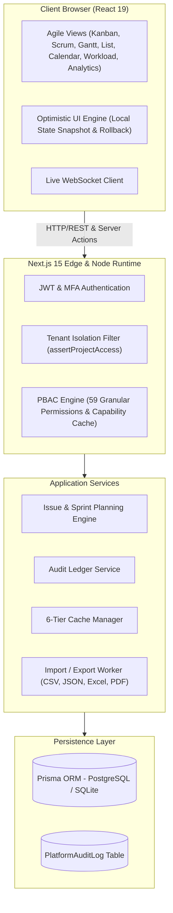

# Eitekh WorkOS: System Architecture & Technical Specifications

> **Version:** 2.0.0-PROD  
> **Framework:** Next.js 15 App Router (React 19 Server Components & Actions)  
> **ORM & Database:** Prisma ORM / SQLite (Dev) / PostgreSQL (Production Target)  
> **State & UI:** Tailwind CSS, Radix Primitives, Lucide Icons, DnD-Kit

---

## 1. Architectural Topology



---

## 2. Multi-Tenant Data Hierarchy

Eitekh WorkOS enforces a 4-tier structural isolation hierarchy:

```
Organization (Enterprise Root)
  └── Workspace (Department / Business Unit)
        └── Project (Scrum / Kanban Engineering Hub)
              ├── Sprints & Milestones
              ├── Epics & Roadmaps
              ├── Issues & Subtasks
              └── Custom Workflows, Automations & Custom Fields
```

Every query executed by application services enforces:
1. `organizationId` verification from the active authenticated session.
2. `workspaceId` constraint against project definitions.
3. `assertProjectAccess(projectId)` ensuring zero unauthorized data leaks across tenant boundaries.

---

## 3. High-Performance Agile View Architecture

Eitekh WorkOS delivers seven interconnected views driven by a single unified issue store:

1. **Kanban Board**: Drag-and-drop workflow progression powered by `@dnd-kit`, WIP limits per column, and optimistic visual updates.
2. **Interactive List**: High-density grid with multi-column sorting, grouping by Epic/Assignee/Status/Priority, and bulk action toolbar.
3. **Scrum Planning Hub**: Sprint lifecycle state machine (Draft -> Active -> Completed), backlog grooming, and velocity calculation.
4. **Timeline & Gantt**: Dynamic date calculation, dependency line plotting (Finish-to-Start, Blocks), and critical path visualization.
5. **Interactive Calendar**: Monthly schedule view with multi-day task ribbons and quick scheduling.
6. **Workload & Capacity Planner**: Real-time capacity balance calculations per engineer (Points / Hours vs Target).
7. **Executive Analytics Suite**: Live burndown charts, CFD (Cumulative Flow Diagram), and velocity trend charts with zero mock data.

---

## 4. Cache Management Strategy

The platform incorporates a 6-tier cache manager (`src/lib/cache.ts`):
1. **PBAC Capability Cache**: `${orgId}:${userId}` scoped permissions (60s TTL).
2. **Project Metadata Cache**: Rapid project settings and member lists.
3. **Workflow Transition Cache**: Pre-compiled allowed status transitions.
4. **Custom Field Definition Cache**: Schema mapping for dynamic metadata.
5. **Issue List Query Cache**: In-memory query result cache with tagged invalidation.
6. **System Announcements & Feature Flags Cache**: Global platform toggle cache.

---

## 5. Security & Compliance Architecture

- **Session Security**: Cryptographically secure session tokens (`crypto.randomUUID()`), HttpOnly SameSite cookies.
- **MFA (Multi-Factor Authentication)**: Time-based One-Time Password (TOTP) enforcement with encrypted backup recovery codes.
- **Audit Ledger**: All state mutations, authentication attempts, privilege escalations, and deletions are recorded with IP, User Agent, and timestamp.
